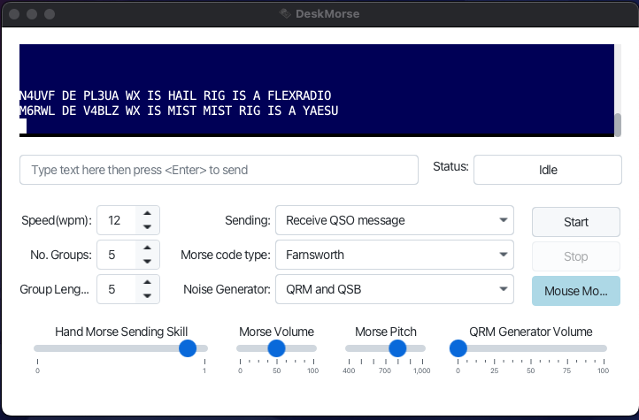

# DeskMorse

A port of a morse training program originally written for RISC OS 

This project is under its initial phase so do not expect it to be fully functional yet.

### Building from source

DeskMorse uses Bellsofts liberica jdk which has java-fx bundled in. If you require to use a different jdk, you will need to install java-fx separately or add the dependencies to the pom.xml

